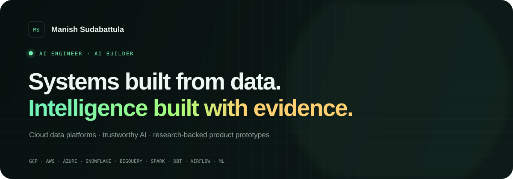

<div align="center">



# Portfolio · AI Systems & Product Lab

**Agentic systems. Evidence-grounded AI. Production-minded engineering.**

[](https://manishsudabattula.github.io/portfolio-me/)
[](https://www.linkedin.com/in/manishsudabattula02)
[](mailto:sudabattulam@gmail.com)

</div>

---

## What This Repository Is

This is more than a personal landing page. It is a dependency-free, GitHub Pages-ready portfolio focused on **AI engineering**, combining agentic systems, RAG, applied machine learning, evaluation, safety, and the cloud/data infrastructure required to run them reliably.

The work focuses on a practical question:

> How do we move intelligent systems from impressive demos to reliable, measurable infrastructure?

The portfolio answers that through interactive prototypes, transparent scoring logic, system architecture, and links to the standards or research behind each design.

## AI Product Lab

<table>
  <tr>
    <td width="33%" valign="top">
      <h3>EvidenceGrid</h3>
      <p><strong>Trust infrastructure for RAG</strong></p>
      <p>Audits claim support, retrieval relevance, latency, and cost before an AI-generated answer reaches users.</p>
      <p><code>RAG</code> <code>Evaluation</code> <code>Prompting</code></p>
      <a href="https://manishsudabattula.github.io/portfolio-me/projects/evidence-grid/">Open interactive demo →</a>
    </td>
    <td width="33%" valign="top">
      <h3>LineageGuard</h3>
      <p><strong>Know the blast radius first</strong></p>
      <p>Combines schema diffs, contracts, and column lineage to detect downstream breakage and generate a safe migration plan.</p>
      <p><code>Lineage</code> <code>Contracts</code> <code>AI Copilot</code></p>
      <a href="https://manishsudabattula.github.io/portfolio-me/projects/lineage-guard/">Open interactive demo →</a>
    </td>
    <td width="33%" valign="top">
      <h3>CarbonShift</h3>
      <p><strong>Run AI when the grid is ready</strong></p>
      <p>Schedules flexible AI workloads against hourly carbon, price, confidence, and deadline constraints.</p>
      <p><code>Optimization</code> <code>Energy Data</code> <code>MLOps</code></p>
      <a href="https://manishsudabattula.github.io/portfolio-me/projects/carbon-shift/">Open interactive demo →</a>
    </td>
  </tr>
</table>

### Why These Projects

| Problem | Product response | Research foundation |
|---|---|---|
| Fluent AI answers can still be unsupported | Claim-level evidence auditing and multidimensional RAG evaluation | [NIST AI 600-1](https://nvlpubs.nist.gov/nistpubs/ai/NIST.AI.600-1.pdf), [RAGAS](https://arxiv.org/abs/2309.15217) |
| A small schema change can silently break critical downstream assets | Pre-merge impact analysis using column lineage and contracts | [OpenLineage object model](https://openlineage.io/docs/spec/object-model/), [column lineage facet](https://openlineage.io/docs/spec/facets/dataset-facets/column_lineage_facet/) |
| AI infrastructure is increasing data-centre electricity demand | Carbon-, cost-, and deadline-aware workload scheduling | [IEA Energy and AI](https://www.iea.org/reports/energy-and-ai/energy-demand-from-ai) |

## Academic Work

| Project | What it demonstrates | Result |
|---|---|---|
| **Adversarial Safenet** | End-to-end adversarial prompt evaluation and safety-aware NLP classification | Tested **500+** prompt variations, achieved **87%** classifier accuracy, and reduced toxic output by **62%** |
| **Citation Graph Mining** | Graph data pipelines, PageRank, and Louvain community detection | Processed **10K+** citation records across **3K+** nodes and surfaced **5** research clusters |

## Engineering Perspective

```text
RAW SIGNALS  -->  TRUSTED DATA  -->  USEFUL INTELLIGENCE
     |                 |                    |
 ingestion         contracts           evaluation
 streaming         lineage             observability
 validation        modeling            measurable value
```

My preferred systems are:

- **Reliable by design** — quality, observability, lineage, and contracts live inside the workflow.
- **Built for scale** — cloud-native patterns remain understandable as data volume and teams grow.
- **Measurable** — AI quality is decomposed into testable dimensions rather than summarized by confidence alone.
- **Explainable to operators** — decisions expose evidence, constraints, and trade-offs.

## Technology Map

| Layer | Technologies |
|---|---|
| **Agentic AI & LLM Systems** | LangGraph, LangChain, tool calling, multi-step workflows, memory, orchestration, guardrails |
| **RAG & Evaluation** | Retrieval pipelines, embeddings, vector search, grounding, hallucination checks, prompt evaluation, RAG evaluation |
| **Machine Learning & NLP** | PyTorch, TensorFlow, Hugging Face, Scikit-learn, Transformers, fine-tuning, NLP |
| **AI Application Engineering** | Python, FastAPI, REST APIs, structured outputs, async workflows, Playwright, Pydantic |
| **MLOps & Observability** | Docker, GitHub Actions, CI/CD, evaluation pipelines, logging, tracing, model monitoring |
| **Cloud & Data Infrastructure** | AWS, GCP, Azure, Spark, Kafka, BigQuery, Snowflake, Airflow, dbt |
| **Security & Reliability** | RBAC, secrets management, prompt safety, audit trails, idempotency, validation |

## Design & Implementation

- Static HTML, modern CSS, and lightweight JavaScript
- No framework, build step, API key, or runtime dependency
- Responsive dark/light visual system
- Accessible semantic structure and reduced-motion support
- Interactive filtering, evaluation controls, and decision-support simulations
- Deployable directly from the repository root with GitHub Pages

```text
portfolio-me/
├── index.html                 # Main portfolio experience
├── styles.css                 # Responsive visual system and animation
├── script.js                  # Theme, filtering, navigation, reveals
├── assets/
│   └── readme-hero.svg        # Repository overview artwork
└── projects/
    ├── evidence-grid/         # RAG evaluation workbench
    ├── lineage-guard/         # Schema impact control plane
    ├── carbon-shift/          # Sustainable AI scheduler
    ├── project.css            # Shared product-demo design system
    └── README.md              # Product research and scope notes
```

## Run Locally

```powershell
python -m http.server 8010
```

Open [http://127.0.0.1:8010](http://127.0.0.1:8010).

## Current Scope

The product-lab demos use deterministic local scenarios so the decision logic remains inspectable without credentials or paid services. Production implementations would connect to model traces, OpenLineage events, live grid signals, persistent storage, authentication, and scheduled workers.

---

<div align="center">

### Have a difficult AI problem?

[Start a conversation](mailto:sudabattulam@gmail.com) · [Explore the portfolio](https://manishsudabattula.github.io/portfolio-me/) · [Connect on LinkedIn](https://www.linkedin.com/in/manishsudabattula02)

<sub>Designed for intelligence. Built with intent.</sub>

</div>
